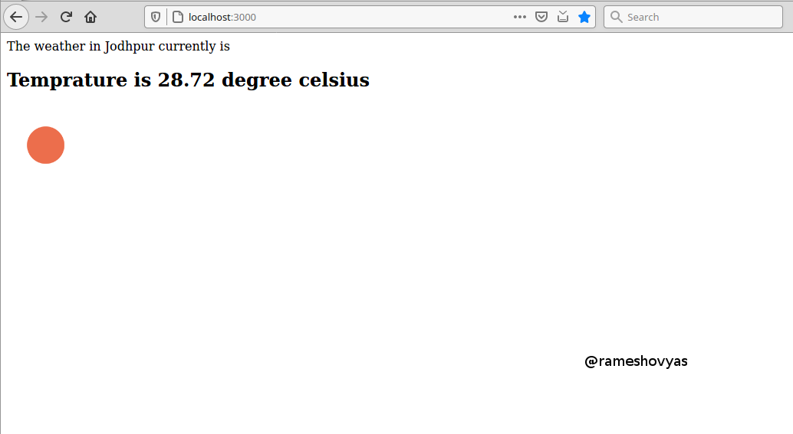

# Weather App in Node JS (Express)
A web based weather information app using Node JS(express) that allows users to type in the city name to find real time weather data. I have used openweathermap.org api to fetch real time weather info. 

See the screenshots how this app works, here is the page that allows to type in the city name.

Weather detail page

